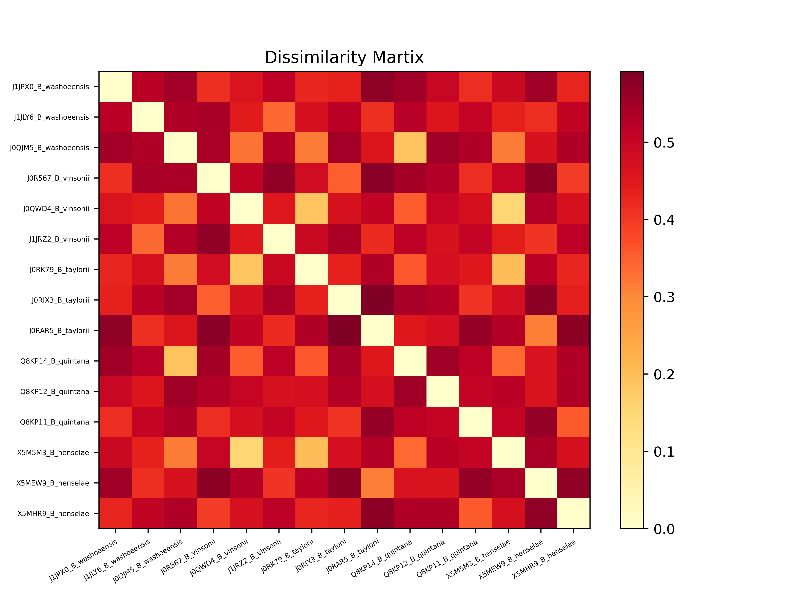
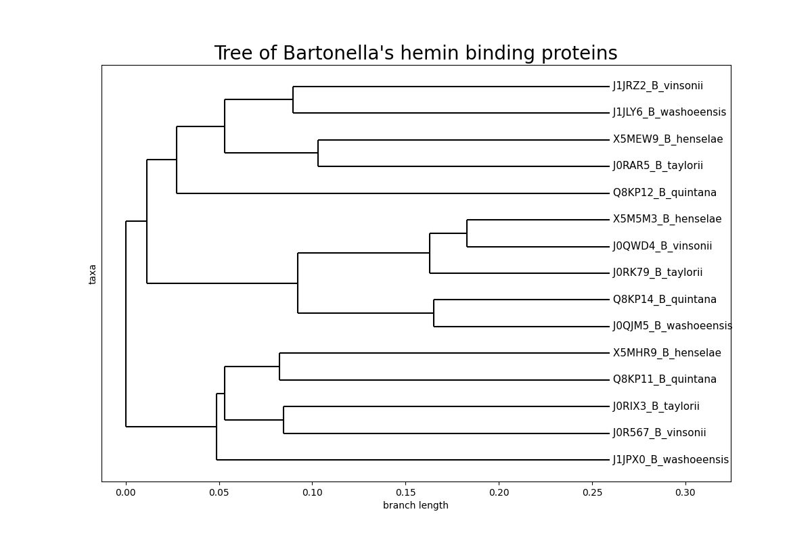

# Bioinformatics Project LU2SV483

## Description

My first uni bioinformatics project with some basic sequence analysis and comparison tools. Some of them are used to compare hemin-binding proteins hbpC, hbpD, hbpE between 5 members of Bartonella spp (alpha-proteo-bacteria). 

For this, corresponding genes were found in Bartonella's WGS sequence set from EMBL database, their coding sequences are localized in the genome and  translated into protein. Those protein sequences are aligned using MSA with star heuristic. Aligned protein sequences are used to build a neighbor joining tree with UPGMA algorithm.

## Usage

This repository already contains all outputs in Output_Files folder, but you can play with the code or change inputs in Files_for_Project folder. 

To create a virtual environment and install  there all required modules, use this command in the terminal:

Unix/MacOS:
```bash
python3 -m venv .venv
source .venv/bin/activate
pip install -r requirements.txt
```

Windows:
```bash
python -m venv .venv
.venv\Scripts\activate
pip install -r requirements.txt
```

But note: star alignment of protein sequences takes some time so it was made once in step 4 and then commented out. Uncomment this line of code in main_step4.py if you want to analyze other protein sequences:
```python 
MSA.write_msa_as_fasta(path_to_prots,path_to_score_matrix, path_to_msa_result)
```
 
## Details

### [Step 1](main_step1.py)

For this step I've written some [basic functions for sequence analysis](Project_Library/basic_seq_analysis.py), here is the example output for the test nucleotide sequences:

```
The sequence to analyze:
GCGCATGCTTACATAGGCCTAACAAACGGCTTATGACTAG

The length of the sequence is 40 nucleotides
The GC content is  0.475

The reverse complement is:
CTAGTCATAAGCCGTTTGTTAGGCCTATGTAAGCATGCGC

ATG positions for the sequence: 4 32
STOP positions for the sequence: 13 19 33 37
ATG positions for the reverse complement: 26 34
STOP positions for the reverse complement: 1 7 19 29

Enter weights for a match, substitution and indel (separated by space)
2 -1 -2

Comparison of two sequences:
AGTTAGAG--TAGGGCCAGCCAGCATAGCA-----GGTT
AGTTCCAGTATAGGCCCA---AGCAAAGCAGTACCGGTT

Matches: 25  Substitutions: 4  Indels: 10
Edit distance: 14
Alignment score is 26.0 (for Wm=2.0 Ws=-1.0 Wi=-2.0)
Identity ratio: 0.64
```

### [Steps 2 and 3](main_step2-3.py)

*see* [*EMBL analysis module*](Project_Library/embl_analysis.py)

[EMBL database file](Files_for_Project/Bartonella.dat) *(European Molecular Biology Laboratory)* with  WGS *(Whole Genome Sequencing)* annotations was used to create a [summary table](Output_Files/Bartonella_embl_summary_usingLISTOFLISTS.txt) with essential information (EMBL ID, species, direction +/-, Uniprot ID and protein function) for each CDS *(CoDing Sequence)* from the file.


| EMBL ID   | Species |    dir  |  begin - end  |  Uniprot  | Function  |
|----------|----------|----------|----------|----------|----------|                                                
| AILX01000001 | Bartonella washoeensis | - | 6409 - 6882   |  J0ZFN6  | hypothetical protein |                                       
|AILX01000001 | Bartonella washoeensis | -   |  6934 - 7647  |   J0QUQ6  |  hypothetical protein |                                       
AILX01000001 |Bartonella washoeensis | -  |  7658 - 8155  | J1JR39  |  hypothetical protein |                                       
*... 9943 lines in total ...*
|AM260525  | Bartonella tribocorum |   - | 2617239 - 2618504| A9IZY3 | transcription termination factor rho | 

Remarks: 
- I didn't get exactly the same result using a list of lists and a dictionary using Uniprot ID as a key. This means that Uniprot ID is not a unique identifier for CDS and we should better use a list of lists or another ID as a key.
- With a list of lists method, I've got 9943 CDSs out of total 10177 CDSs. This is because all incomplete CDSs were excluded. Indeed, a search for a regular expression  ```CDS.*[<>]``` gives 234 incomplete sequences, so we can simply check that 9943+234=10177.

The same EMBL file was employed for the selection of proteins and species of interest. [Criteria for this selection](Files_for_Project/criteria_for_gene_selection.txt) were formulated as regular expressions and stored as a .txt file
with species name, gene name and protein function (product) on 1st, 2nd and 3rd line respectively:

```
Bartonella (henselae|quintana|taylorii|vinsonii|washoeensis)
hbp(C|D|E)
OMP_b-brl
```
The short summary of [selected proteins](Output_Files/Bartonella_embl_summary_selective.txt):

| Species | Uniprot ID | Function |
|----------|----------|----------|
| Bartonella washoeensis  | J1JPX0   | OMP beta-barrel domain containing protein |
| Bartonella washoeensis | J1JLY6  | OMP beta-barrel domain containing protein|
| Bartonella washoeensis  | J0QJM5   | OMP beta-barrel domain containing protein |
| Bartonella vinsonii | J0R567   | OMP beta-barrel domain containing protein |
| Bartonella vinsonii | J0QWD4    | OMP beta-barrel domain containing protein  |
| Bartonella vinsonii  | J1JRZ2  | OMP beta-barrel domain containing protein  |
| Bartonella taylorii | J0RK79  | OMP beta-barrel domain containing protein |
| Bartonella taylorii | J0RIX3   | OMP beta-barrel domain containing protein  |
| Bartonella taylorii | J0RAR5   | OMP beta-barrel domain containing protein |
| Bartonella quintana   | Q8KP14   | hbpC |
| Bartonella quintana | Q8KP12   | hbpD |
| Bartonella quintana  | Q8KP11   | hbpE |
| Bartonella henselae   | X5M5M3   | hbpC |
| Bartonella henselae  | X5MEW9  | hbpD  |
| Bartonella henselae   | X5MHR9  | hbpE |

Then, thanks to found CDS boarders and directions, corresponding nucleotide sequences were localized in [the genome](Files_for_Project/Bartonella.fasta).

Obtained CDSs were [translated](Project_Library/basic_seq_analysis.py) into [protein sequences](Output_Files/selected_proteins.fasta) using a specific [genetic code](Files_for_Project/CodeGenetique.tab). 

In the scope of those steps I've also written a function [find_all_ORFs()](Project_Library/basic_seq_analysis.py) that finds all ORFs *(Open Reading Frames)* for a given sequence. Here's an example output:

```
For a sequence:
GCATGCGAGCTATATGCATGGCCTACACGCTAAAGATGCAGATGCTAAATACGGAAGCAGACCGTAGCGCTTGATACATCTCGTAAGCATA
3 ORF(s) on the + strand: 2-73, 13-66, 17-73
2 ORF(s) on the - strand: 1-81, 12-68
```

### [Step 4](main_step4.py)

*see* [*MSA analysis*](Project_Library/msa_analysis.py) *and* [*UPGMA*](Project_Library/upgma.py) *modules*

First, obtained protein sequences were aligned using [MSA](Project_Library/msa.py) *(Multiple Sequence Alignment)* with star heuristic.

Since the alignment of those protein sequences takes some time, it was made once, the result was [saved as .fasta](Output_Files/aligned_selected_proteins.fasta) and then the corresponding line of code was commented out.

With the help of [BLOSUM62](Files_for_Project/blosum62.mat) substitution matrix, the overall MSA score was computed (54255) as well as the score for each position of the alignment, which I've represented as a barcode:


Based on aligned sequences, a dissimilarity matrix was computed and represented as a heatmap (sequences in a random order):



The dissimilarity matrix was then put into the [UPGMA algorithm](Project_Library/upgma.py) *(Unweighted Pair Group Method with Arithmetic Mean)*. The resulting tree was at first stored as a dictionary {parent : (weight, (child_i_name, dist_i), (child_j_name, dist_j))}.

This dictionary was unpacked using a stack data structure as an intermediate, and then converted to newick parenthesized format as well as to a list of ordered according to it sequences.

The neighbor joining (NJ) tree was drawn based on the newik representation with [Biopython](requirements.txt) module. 



The dissimilarity matrix was rearranged so that the order of sequences matches the one in the tree:


### General Conclusion

The comparison of hemin-binding proteins hbpC, hbpD, hbpE between 5 members of Bartonella spp. allows us to suggest that those proteins have diverged before the speciation of *B. henselae, B. quintana, B. taylorii, B. vinsonii,* and *B. washoeensis*, since the distances between sequences related to the same species are **always** grater than those between different species. Unfortunately, we cannot fully analyze this tree since for the majority of sequences the correspondence between hbp gene type (C,D or E) and UniprotID is not established (these were marked as just "OMP beta-barrel domain containing protein"). But for those with known correspondence we can see that there're situated close on the tree, this supports the hypothesis above.


